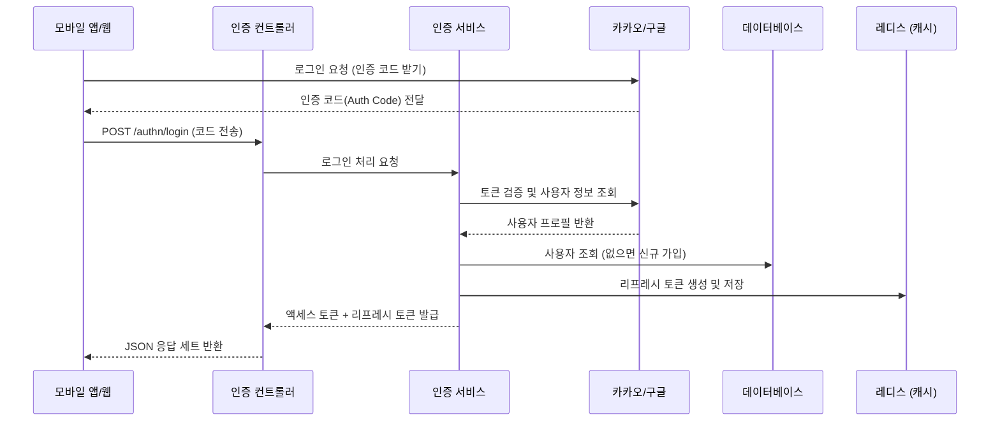

# 시스템 설계 명세서 (System Specification)

**프로젝트명:** FourPillars (사주팔자 만세력 서비스)  
**버전:** 1.0.1  
**날짜:** 2025-12-30  

---

## 1. 설계 요약 (Architecture Summary)

### 1.1 기술 스택 (Technical Stack)
- **언어:** Java 17, Shell Script
- **프레임워크:** Spring Boot 3.5.6 (Spring Security, Spring Data JPA, Spring WebFlux)
- **데이터베이스:** MariaDB (데이터 저장), Redis (캐시/세션/속도제한)
- **인프라:** Docker Compose, AWS Lightsail (Ubuntu)
- **보안:** OAuth2 (구글, 카카오, 네이버), JWT (인증 토큰), TOTP (관리자 2차 인증)
- **빌드 도구:** Gradle 8.x

### 1.2 시스템 아키텍처
본 시스템은 **계층형 아키텍처(Layered Architecture)**를 기반으로 하며, **헥사고날 아키텍처(Hexagonal Architecture)**의 개념을 일부 차용하여 설계되었습니다.

1.  **인터페이스 계층 (`interfaces`)**: 사용자의 HTTP 요청을 처리하고 데이터를 변환(DTO)합니다.
2.  **응용 계층 (`application`)**: 비즈니스 로직을 조율하고 트랜잭션을 관리합니다. (서비스)
3.  **도메인 계층 (`domain`)**: 핵심 업무 규칙과 엔티티를 정의합니다. (순수 로직)
4.  **인프라 계층 (`infrastructure`)**: DB, Redis, OAuth 등 외부 시스템과의 통신을 담당합니다.

---

## 2. 패키지 구조 (Package Structure)

```text
com.kolloseum.fourpillars
├── application         # 응용 서비스 (비즈니스 유스케이스)
│   ├── mapper          # 객체 변환기
│   └── service         # 서비스 인터페이스 및 구현체
├── common              # 공통 유틸리티 및 예외 처리
│   ├── exception       # 비즈니스 예외 정의
│   ├── logger          # 로깅 유틸리티
│   ├── response        # API 공통 응답 규격
│   └── utils           # 날짜, 암호화 등 유틸리티
├── domain              # 도메인 핵심 로직
│   ├── model           # 엔티티(Entity), VO, Enums
│   ├── repository      # 저장소 인터페이스 (DIP 적용)
│   └── service         # 도메인 순수 로직 서비스
├── infrastructure      # 인프라 구현체 (외부 어댑터)
│   ├── adapter         # 만세력 계산 어댑터 (Time4J)
│   ├── config          # 스프링 설정 (Swagger, WebMvc)
│   ├── file            # 엑셀/파일 처리
│   ├── persistence     # JPA 엔티티 및 리포지토리 구현
│   ├── redis           # Redis 캐시 & Rate Limit 설정
│   └── security        # 보안 설정, JWT, OAuth2 연동
└── interfaces          # 웹 인터페이스 (컨트롤러)
    ├── controller      # REST API 컨트롤러
    ├── dto             # 데이터 전송 객체 (Request/Response)
    └── mapper          # DTO 변환기
```

---

## 3. 자료 흐름도 (Data Flow Diagram)

### 3.1 인증 흐름 (로그인 및 JWT 발급)
사용자가 소셜 로그인을 시도하면 인증 코드를 받아 백엔드에서 검증 후 JWT(액세스/리프레시 토큰)를 발급합니다.



### 3.2 운세 조회 흐름 (캐시 전략)
반복적인 운세 계산 부하를 줄이기 위해 Redis 캐시를 우선 확인하는 캐시-어사이드(Cache-Aside) 전략을 사용합니다.

```mermaid
graph LR
    A[사용자] -->|GET /contents/monthly| B(컨텐츠 컨트롤러)
    B --> C{운세 서비스}
    C -->|캐시 확인| D[(Redis)]
    D -->|있음 (Hit)| B
    D -->|없음 (Miss)| E[만세력 계산기]
    E -->|계산 로직| F[(MariaDB)]
    F -->|사용자 정보| E
    E -->|캐시 저장| D
    E -->|결과 반환| B
```

---

## 4. 자료 사전 (Data Dictionary)

### 4.1 사용자 (`users`)
회원의 핵심 계정 정보를 관리하는 테이블입니다.

| 필드명 | 타입 | 제약조건 | 설명 |
|---|---|---|---|
| `id` | BIGINT | PK, Auto Inc | 사용자 고유 식별자 |
| `social_id` | VARCHAR(255) | Unique, Not Null | 소셜 제공자 측의 고유 ID |
| `provider` | ENUM | Not Null | 가입 경로 (GOOGLE, KAKAO, NAVER) |
| `role` | ENUM | Not Null | 권한 (USER: 일반, ADMIN: 관리자) |
| `last_login_at`| DATETIME | Nullable | 마지막 로그인 일시 |
| `created_at` | DATETIME | Not Null | 계정 생성일 |
| `updated_at` | DATETIME | Not Null | 정보 수정일 |

### 4.2 사용자 프로필 (`user_profiles`)
사주 계산에 필요한 사용자의 상세 사주 정보를 저장합니다.

| 필드명 | 타입 | 제약조건 | 설명 |
|---|---|---|---|
| `id` | BIGINT | PK | 사용자 ID (users 테이블 참조) |
| `name` | VARCHAR(100) | Not Null | 사용자 표시 이름 (닉네임) |
| `birth_date` | DATE | Not Null | 생년월일 |
| `birth_time` | TIME | Nullable | 태어난 시각 |
| `calendar_type` | ENUM | Not Null | 양력/음력 구분 (SOLAR, LUNAR) |
| `gender` | ENUM | Not Null | 성별 (MALE, FEMALE) |

### 4.3 약관 (`terms`)
서비스 이용 약관 및 개인정보 처리방침 내용을 버전별로 관리합니다.

| 필드명 | 타입 | 제약조건 | 설명 |
|---|---|---|---|
| `id` | BIGINT | PK, Auto Inc | 약관 ID |
| `type` | ENUM | Not Null | 약관 종류 (PRIVACY: 개인정보, SERVICE: 이용약관) |
| `version` | VARCHAR(20) | Not Null | 버전 정보 (예: 1.0) |
| `content` | TEXT | Not Null | 약관 내용 (HTML 형식) |
| `is_required` | BOOLEAN | Default True | 필수 동의 여부 |
| `is_active` | BOOLEAN | Default True | 현재 유효한 약관 여부 |

---

## 5. 기능 명세서 (Functional Specifications)

### 5.1 인증 API (Authentication)
- **로그인 (`POST /authn/login`)**
    - **입력:** `provider` (가입 경로), `token`/`code` (인증 토큰)
    - **처리:** 소셜 인증 토큰 검증 → 신규 유저 자동 가입 → JWT 발급
    - **출력:** `accessToken`, `refreshToken`, `expiresIn` (만료 시간)
- **토큰 갱신 (`POST /authn/refresh`)**
    - **입력:** `refreshToken`
    - **처리:** Redis에 저장된 토큰과 대조 및 유효성 검사 (Blacklist 확인)
    - **출력:** 새로운 `accessToken`

### 5.2 운세 API (Fortune)
- **월간 운세 조회 (`GET /contents/monthly`)**
    - **입력:** `year`, `month` (생략 시 현재 날짜 기준)
    - **처리:** 사용자의 생년월일시를 기반으로 해당 월의 사주 명식 및 운세 계산
    - **출력:** 운세 텍스트, 행운의 색/숫자, 점수

### 5.3 관리자 포털 (Admin Web)
- **대시보드:** 시스템 상태 모니터링 (CPU, 메모리, 스레드 상태 - Spring Boot Admin 연동)
- **보안:** 구글 로그인 + TOTP(구글 OTP)를 통한 엄격한 2단계 인증 접근 제어
- **기능:** 서버 원격 재시작, 실시간 로그 조회, 환경변수 확인
